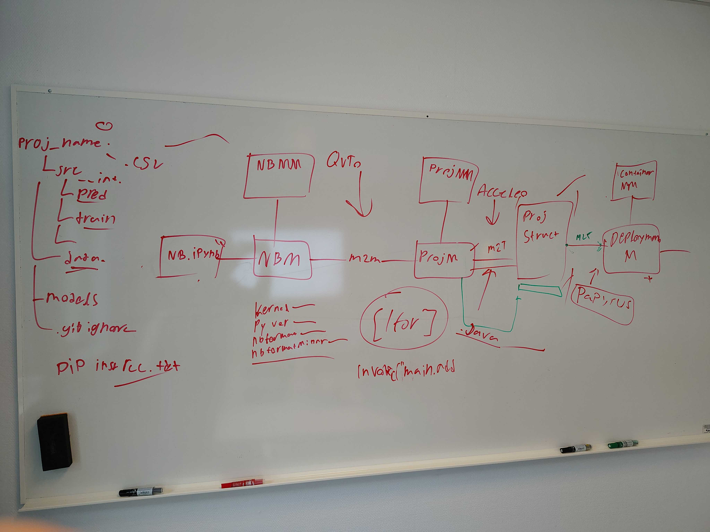

# README

**NOTE:** [Commit messages should follow specification](https://www.conventionalcommits.org/en/v1.0.0/#specification)
**NOTE 1:** When merging use `--squash`




<!-- [Prompt with structure ideas and implementation](https://claude.ai/share/4a0e1a41-79a5-4cbc-9ee2-3b9e08002e14) -->

### Send a message to the prediction service in the docker container

```bash
curl -X POST address/predict \
  -H "Content-Type: application/json" \
  -d '{
    "features": {
      "age": 35,
      "monthly_charges": 75.5,
      "total_usage": 450,
      "usage_per_month": 37.5,
      "support_ratio": 0.5,
      "contract_type": "monthly"
    }
  }'

```
